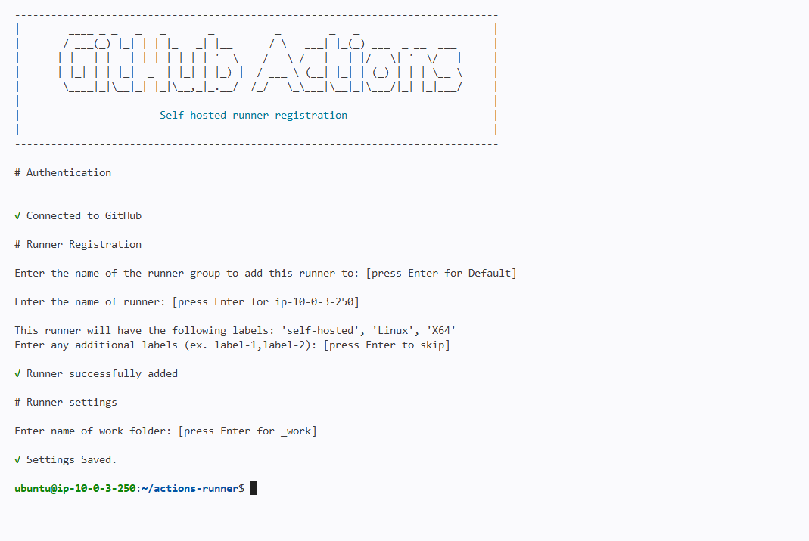
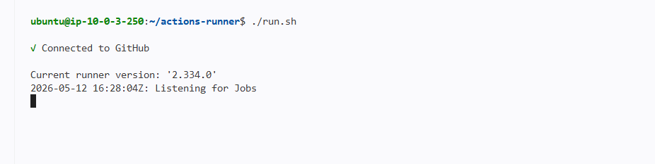
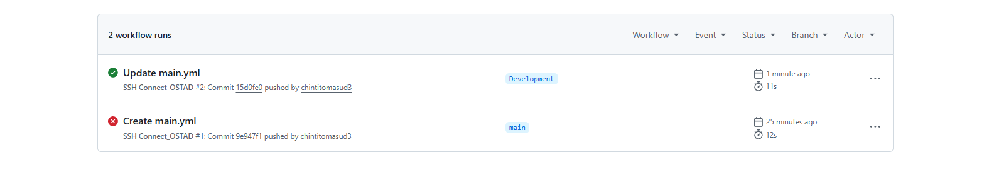
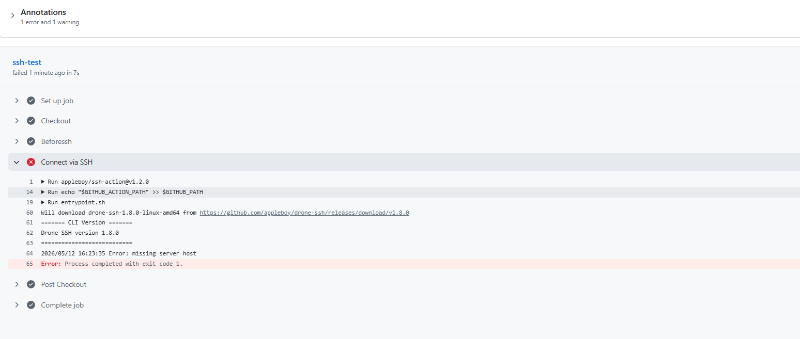
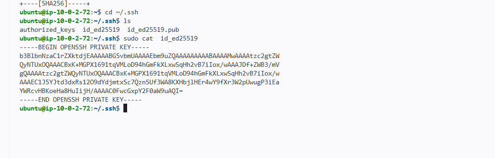
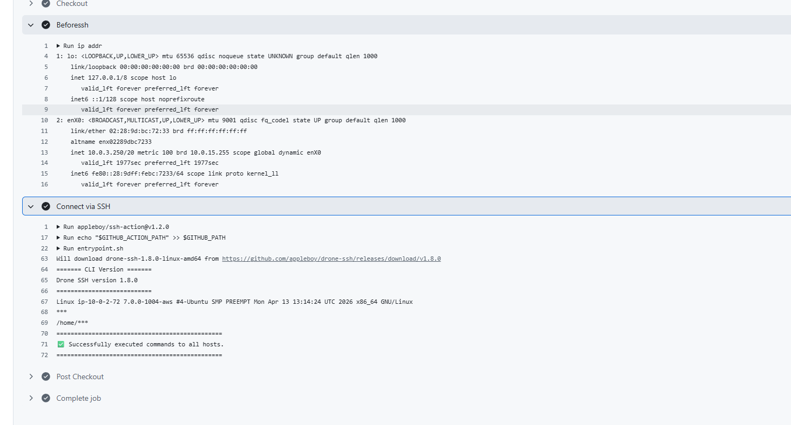
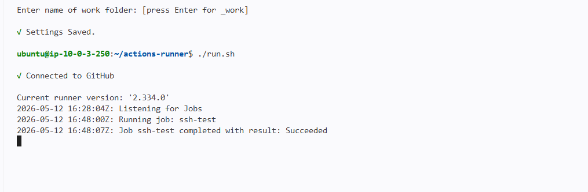

# GitHub Actions Fundamentals - Assignment Solution


### 1. Project Setup
Link : https://github.com/chintitomasud3/Ostad_Assignment-GitHub-Actions-Fundamentals


### 2. GitHub Actions Workflow YAML

Create `.github/workflows/main.yml`:

```yaml
name: SSH Connect_OSTAD

on:
  push:
    branches:
      - Development

jobs:
  ssh-test:
    runs-on: self-hosted

    steps:
      - name: Checkout
        uses: actions/checkout@v4
      - name: Beforessh
        run: |
          ip addr
  

      - name: Connect via SSH
        uses: appleboy/ssh-action@v1.2.0
        with:
          host: ${{ secrets.SSH_HOST }}
          username: ${{ secrets.SSH_USER }}
          key: ${{ secrets.SSH_PRIVATE_KEY }}
          port: 22

          script: |
            uname -a
            whoami
            pwd
            
```


### 3. Screenshots to Capture

# GitHub Action Screenshots

## 1. GitHub Action Runner Setup


## 2. Runner Working Status


## 3. Job Status (Failed & Success)


## 4. Failed Pipeline View


## 5. Private Key Configuration


## 6. Successful Pipeline


## 7. Successful Runner Test

---

## CONCEPT EXPLANATIONS

### What is CI/CD?

**CI/CD (Continuous Integration/Continuous Deployment)** is a software development practice that automates the process of:

- **Continuous Integration (CI)**: Developers frequently merge code changes into a central repository. Automated builds and tests run to detect integration errors early.
  
- **Continuous Deployment/Delivery (CD)**: Code changes are automatically prepared and deployed to production or staging environments.

**Benefits:**
- Faster release cycles
- Early bug detection
- Reduced manual errors
- Consistent deployment process
- Improved collaboration

### What is a Self-Hosted Runner?

A **self-hosted runner** is a server/computer that you manage and configure to execute jobs from GitHub Actions workflows.

**Differences from GitHub-hosted runners:**

| Feature | GitHub-Hosted | Self-Hosted |
|---------|---------------|-------------|
| **Managed by** | GitHub | You |
| **Cost** | Free (with limits) | Your infrastructure cost |
| **Customization** | Limited | Full control |
| **Hardware** | Standard configs | Any specs you need |
| **Software** | Pre-installed tools | You install everything |
| **Network** | GitHub's network | Your network access |

**When to use self-hosted:**
- Need specific hardware/software
- Require access to internal network/resources
- Need better performance/cost ratio
- Compliance/security requirements

### Workflow Execution Process

1. **Trigger**: Code is pushed to `development` branch
   
2. **GitHub detects change**: GitHub Actions identifies the matching workflow

3. **Queue job**: Job is queued for the self-hosted runner


---


